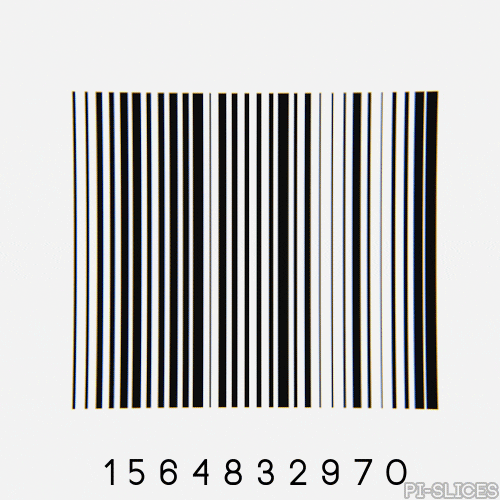

<div align="center" id="top"> 
  

&#xa0;

  <!-- <a href="https://expobarcoderscanner.netlify.app">Demo</a> -->
</div>

<h1 align="center">Expo Barcoder Scanner</h1>

<p align="center">
  

  

  

  

  <!--  -->

  <!--  -->

  <!--  -->
</p>

<p align="center">
  <a href="#dart-about">About</a> &#xa0; | &#xa0; 
  <a href="#rocket-technologies">Technologies</a> &#xa0; | &#xa0;
  <a href="#white_check_mark-requirements">Requirements</a> &#xa0; | &#xa0;
  <a href="#checkered_flag-starting">Starting</a> &#xa0; | &#xa0;
  <a href="#memo-license">License</a> &#xa0; | &#xa0;
  <a href="https://github.com/{{YOUR_GITHUB_USERNAME}}" target="_blank">Author</a>
</p>

<br>

## :dart: About

Project created for the implementation of expo camera and its use as a barcode reader or others

## :rocket: Technologies

The following tools were used in this project:

- [Expo](https://expo.io/)
- [React Native](https://reactnative.dev/)
- [TypeScript](https://www.typescriptlang.org/)

## :white_check_mark: Requirements

Before starting :checkered_flag:, you need to have [Git](https://git-scm.com), [Node](https://nodejs.org/en/) and [Expo](https://docs.expo.dev/) installed.

Additionally, it requires installing [Expo go](https://expo.dev/go) on your mobile device.

## :checkered_flag: Starting

```bash
# Clone this project
$ git clone https://github.com/AJ-Derteano/expo-barcoder-scanner

# Access
$ cd expo-barcoder-scanner

# Install dependencies
$ npm install

# Run the project
$ npm run start

# Scan the QR or access through the link provided in the terminal
```

## :memo: License

This project is under license from MIT. For more details, see the [LICENSE](LICENSE.md) file.

Made with :heart: by <a href="https://github.com/AJ-Derteano" target="_blank">AJ Derteano</a>

&#xa0;

<a href="#top">Back to top</a>
